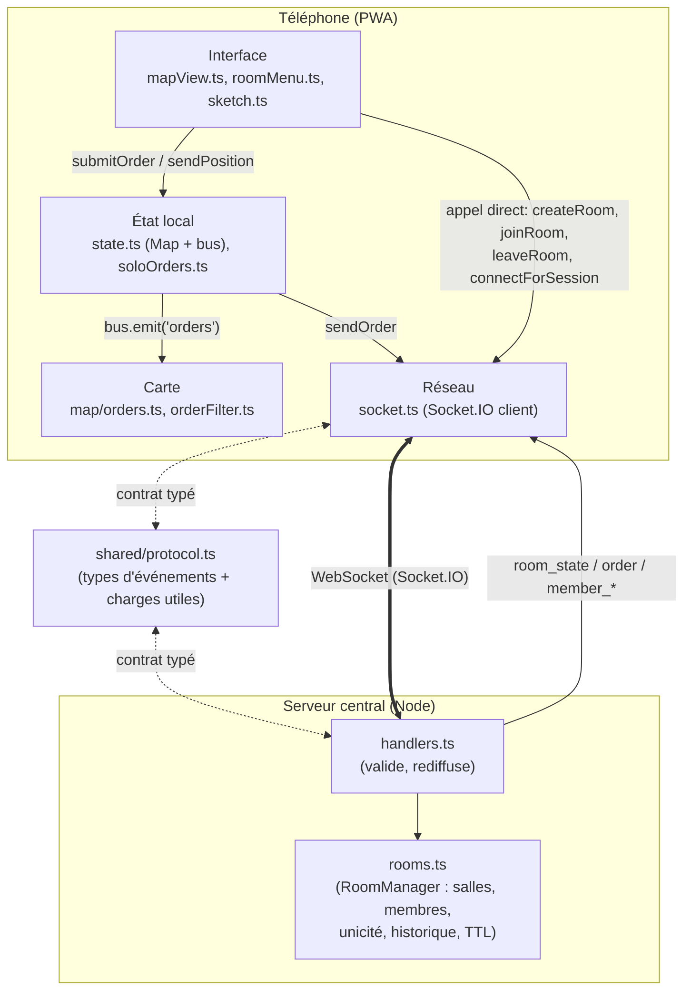
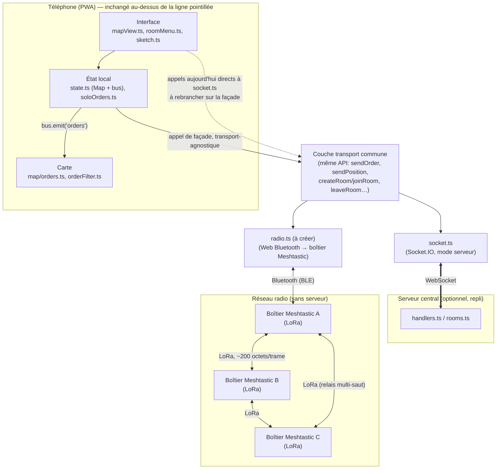

# TacQuest → TacMesh : comment le code marche aujourd'hui, et ce qui doit bouger

Ce document ne modifie rien. C'est une lecture du dépôt tel qu'il est, pour préparer le retrait du serveur central et l'ajout du transport radio Meshtastic.

Fichiers lus pour cette analyse : `client/src/socket.ts`, `client/src/state.ts`, `client/src/soloOrders.ts`, `client/src/map/orders.ts`, `client/src/map/orderFilter.ts`, `client/src/views/mapView.ts`, `client/src/views/roomMenu.ts`, `shared/src/protocol.ts`, `shared/src/constants.ts`, `server/src/handlers.ts`, `server/src/rooms.ts`.

---

## 1. Comment ça marche aujourd'hui : le trajet d'un dessin

Prenons le cas le plus courant : tu traces une ligne (un axe, un liseré) sur la carte avec ton doigt.

1. **Le geste.** Le tracé au doigt est capturé par `client/src/map/sketch.ts` (`PolylineSketch`), qui construit une suite de points. C'est `client/src/views/mapView.ts` qui pilote ce composant et, une fois le tracé validé, construit un objet `OrderMessage` : un id généré côté client (uuid), un `authorId` (obtenu via `orderAuthor()` dans `soloOrders.ts` — soit ton `memberId` si tu es dans une salle, soit la constante `SOLO_AUTHOR` sinon), un `ts`, et le `payload` (`{ kind: 'graphic', geojson, style }`, typé dans `shared/src/protocol.ts`).

2. **`mapView.ts` appelle `submitOrder(o)`**, définie dans `client/src/soloOrders.ts`. Cette fonction est l'aiguillage central entre les deux modes de l'appli :
   - Si `state.session` existe (tu es dans une salle) → elle délègue à `sendOrder(o)`, importée depuis `client/src/socket.ts`.
   - Sinon (mode solo, hors salle) → elle applique l'ordre directement sur `state.orders` (une `Map`) et le sauvegarde dans `localStorage` (clé `tq-solo-orders`). Aucun réseau n'intervient dans ce cas.

3. **En salle, `socket.ts::sendOrder(o)` applique l'ordre en local *avant même* de l'envoyer** (« application optimiste ») : `state.orders.set(o.id, o)` puis `bus.emit('orders')` — ton propre écran se met donc à jour instantanément, sans attendre le réseau. L'ordre est ensuite empilé dans une file `outbox` (elle aussi persistée dans `localStorage`, clé `tq-outbox`, pour survivre à une coupure ou une fermeture de l'appli), et `flushOutbox()` tente de la vider vers le serveur via `socket.emitWithAck('send_order', o)`.

4. **Le serveur reçoit l'événement `send_order`** dans `server/src/handlers.ts`. Il valide la charge (`isValidOrder` : forme, `authorId` cohérent avec le socket, taille JSON ≤ `MAX_ORDER_BYTES` = 16 384 octets, cf. `shared/src/constants.ts`), applique un anti-flood par membre (`manager.acceptOrder`, dans `server/src/rooms.ts`), range l'ordre dans l'historique de la salle (`manager.pushOrder`, un buffer circulaire plafonné à `MAX_RECENT_ORDERS` = 250), puis **rediffuse** l'ordre à tous les autres membres de la salle : `socket.to(room.code).emit('order', order)`. Il répond aussi un accusé de réception (`ack({ ok: true })`) à l'auteur.

5. **Chez les autres joueurs**, `socket.ts` écoute `socket.on('order', ...)` : l'ordre reçu est posé dans `state.orders` et `bus.emit('orders')` est déclenché — exactement le même chemin que l'application optimiste locale à l'étape 3.

6. **Le dessin apparaît à l'écran.** `mapView.ts` écoute `bus.on('orders', ...)` et appelle `ordersLayer.sync(state.orders)`. `OrdersLayer.sync()` (dans `client/src/map/orders.ts`) compare ce qui est déjà dessiné à ce qui devrait l'être — la liste des graphiques et points visibles étant calculée par des fonctions pures et sans dépendance réseau, `visibleGraphics()` / `visibleWaypoints()` dans `client/src/map/orderFilter.ts` (elles filtrent aussi les ordres `remove`) — et ajoute/retire les tracés Leaflet en conséquence.

**Pour un retardataire** (quelqu'un qui rejoint la salle après coup) : à la connexion (`create_room`, `join_room` ou `rejoin_room`), le serveur renvoie un `RoomState` complet contenant `recentOrders` — tout l'historique connu de la salle (jusqu'à 250 ordres). `applyRoomState()` dans `state.ts` remplace alors entièrement `state.orders` par ce snapshot. C'est la seule façon dont quelqu'un qui arrive en retard récupère les dessins déjà posés — il n'y a pas de rejeu ordre par ordre, juste une photo complète envoyée par le serveur.

En résumé, la chaîne est : **doigt → sketch.ts → mapView.ts → soloOrders.ts (aiguillage) → socket.ts (optimiste + file + réseau) → serveur (valide, historise, rediffuse) → socket.ts des autres → state.ts → bus → mapView.ts → map/orders.ts (dessin)**.

---

## 2. Les couches du client, et ce qu'elles deviennent

### Interface (gestes, menus, panneaux)
- **Fichiers** : `views/mapView.ts`, `views/roomMenu.ts`, `views/tacPanel.ts`, `views/commsPanel.ts`, `views/installGate.ts`, `map/sketch.ts` (capture du tracé au doigt), `map/protractor.ts`, `map/compass.ts`.
- **Rôle** : traduire les gestes de l'utilisateur (tap, tracé, menus) en objets métier (`OrderMessage`, `Position`) et en appels aux autres couches ; afficher les statuts (connexion, file d'attente).
- **Classement : à modifier, mais peu.** Ces fichiers n'ont aucune idée de *comment* un ordre part sur le réseau — mais ils **appellent directement des fonctions de `socket.ts` par leur nom** : `mapView.ts` importe `connectForSession`, `leaveRoom`, `pendingOrderCount`, `restorePendingOrders`, `sendPosition` depuis `'../socket'` ; `roomMenu.ts` importe `createRoom`, `joinRoom`, `FIXED_ROLE` depuis `'../socket'`. Tant que tu gardes ces mêmes noms de fonctions exposés par une couche « transport », ces fichiers n'ont rien à changer sur le fond — juste, éventuellement, la ligne d'import.

### Carte (rendu visuel)
- **Fichiers** : `map/orders.ts` (`OrdersLayer`), `map/orderFilter.ts` (filtrage pur), `map/markers.ts`, `map/layers.ts`, `map/missions.ts`, `map/missionCatalog.ts`, `map/symbols.ts`, `map/grid.ts`, `map/rotate.ts`.
- **Rôle** : transformer les données déjà en mémoire (`state.orders`, `state.members`) en dessins Leaflet. Aucun de ces fichiers ne touche à Socket.IO, à `localStorage`, ni au réseau — `orderFilter.ts` est même explicitement écrit pour être testable sans navigateur (« Pur (sans Leaflet) »).
- **Classement : inchangée.** C'est la couche la mieux isolée du projet. Elle ne sait même pas que le réseau existe ; elle ne consomme que des `Map` déjà remplies. Tant que `state.orders` reste alimentée de la même façon (même forme d'`OrderMessage`), rien ici ne bouge.

### État local (mémoire + persistance + bus d'événements)
- **Fichiers** : `state.ts` (les `Map` en mémoire, le bus `bus.on`/`bus.emit`, la session, la persistance `localStorage`), `soloOrders.ts` (aiguillage solo/salle).
- **Rôle** : source de vérité unique en mémoire ; découple la couche réseau de la couche carte via le bus d'événements (`'orders'`, `'members'`, `'position'`, `'conn'`…) plutôt que des appels directs.
- **Classement : à modifier — c'est le point de couture naturel.** `soloOrders.ts::submitOrder()` fait déjà un `if (state.session) sendOrder(o) else <local>`. Pour TacMesh, ce `if` binaire doit devenir un aiguillage à trois branches (solo / serveur / radio), ou mieux : `sendOrder` doit devenir un point d'entrée générique qui ne connaît pas le transport concret. Plus profond : **`state.ts::Session`** (interface avec `roomCode`, `memberId`, `sessionToken`, `isLeader`) modélise un concept typiquement serveur — une identité *attribuée* par un arbitre central. Sans serveur, ce modèle ne s'effondre pas totalement (tu peux garder un `memberId` local généré par le téléphone), mais `sessionToken` en particulier n'a plus de sens : il sert à prouver à un serveur qu'on est bien le même membre qu'avant (`rejoin_room`), or il n'y a plus de serveur à convaincre.

### Réseau (transport)
- **Fichiers** : `socket.ts` (client), `shared/src/protocol.ts` (contrat des événements), `server/src/handlers.ts` + `server/src/rooms.ts` (+ `persistence.ts`, `rateLimit.ts`, `admin.ts` côté serveur).
- **Rôle** : ouvrir/maintenir la connexion Socket.IO, gérer la file d'attente hors-ligne (`outbox`), les accusés de réception, la reconnexion et le re-binding de session.
- **Classement** :
  - `socket.ts` (client) : **à garder tel quel, en parallèle** — pas à supprimer. Tu vas probablement vouloir garder le mode « serveur » disponible (tests, secours, usage indoor avec Wi-Fi), et créer un second module, ex. `radio.ts` ou `meshtastic.ts`, qui expose la **même** interface publique (`sendOrder`, `sendPosition`, `createRoom`/`joinRoom` ou équivalent, `leaveRoom`, `pendingOrderCount`…). Les deux implémentations vivent derrière une couche commune que le reste du code appelle sans savoir laquelle est active.
  - `shared/src/protocol.ts` : **à modifier.** `ClientToServerEvents` / `ServerToClientEvents` sont pensés pour Socket.IO (événements nommés, callbacks d'ack) — ça ne correspond à rien sur une liaison radio point-à-multipoint de ~200 octets par trame. Les *types de charge utile* (`OrderMessage`, `Position`, `GraphicStyle`, `OrderPayload`) restent probablement réutilisables comme vocabulaire commun, mais l'enveloppe de transport (acks, événements) doit être repensée pour la radio, et `MAX_ORDER_BYTES` doit tomber de 16 384 à environ 200 — voir la section suivante, c'est la contrainte la plus dure du projet.
  - `server/src/handlers.ts` + `rooms.ts` : **à garder inchangés si tu gardes le mode serveur en option**, sinon disparaissent avec lui. Mais leur *logique* (unicité, historique, anti-flood) doit être relue une par une pour comprendre ce qui n'a pas d'équivalent en mesh — voir ci-dessous.

### Est-ce que `socket.ts` est bien isolé du reste du code ?

**Partiellement.** Deux choses distinctes à distinguer :

1. **La mécanique interne de `socket.ts`** (timers d'ack, `outbox`, clé `localStorage` `tq-outbox`, logique de `rejoin`) ne fuit nulle part ailleurs — bien isolée, elle ne dépend que de `state.ts` (import à sens unique : `socket.ts` importe `state.ts`, jamais l'inverse).
2. **Les points d'appel**, eux, sont dispersés dans trois fichiers différents qui importent directement des fonctions nommées de `'../socket'` ou `'./socket'` : `soloOrders.ts` (`sendOrder`), `views/mapView.ts` (`connectForSession`, `leaveRoom`, `pendingOrderCount`, `restorePendingOrders`, `sendPosition`), `views/roomMenu.ts` (`createRoom`, `joinRoom`, `FIXED_ROLE`). Il n'y a **pas d'interface abstraite** entre ces appelants et `socket.ts` — ils appellent directement les fonctions concrètes du module Socket.IO.

Conséquence pratique : tu peux glisser un transport radio en dessous **sans toucher à la logique** de `mapView.ts`, `roomMenu.ts` ou `map/orders.ts` — leur code métier ne changerait pas. Mais tu devras quand même **changer trois lignes d'import** (dans ces trois fichiers) pour pointer vers une nouvelle couche « transport » qui choisit elle-même, en interne, d'appeler `socket.ts` ou le module radio. C'est un remaniement léger (renommer des imports), pas une réécriture — à condition de conserver exactement les mêmes noms et signatures de fonctions dans la nouvelle façade.

---

## 3. Schémas

### Architecture actuelle

### Architecture cible : deux transports sous une couche commune

---

## Ce qui va vraiment poser problème sans serveur

Ces points dépendent d'un **arbitre central** — un rôle que ni les boîtiers Meshtastic ni le téléphone ne jouent naturellement dans un maillage symétrique :

1. **Unicité des indicatifs (`callsign`).** `server/src/rooms.ts::joinRoom()` refuse un indicatif déjà pris par un membre connecté (`CALLSIGN_TAKEN`) en le comparant à *tous* les membres de la salle, une info que seul le serveur connaît en totalité. Sans lui, deux personnes peuvent choisir le même indicatif sans que rien ne les en empêche *avant coup* — au mieux tu détectes le conflit après coup en voyant deux membres avec le même nom.

2. **`sessionToken` et le re-binding (`rejoin_room`).** Le mécanisme de reconnexion (`socket.ts::rejoin()`, `rooms.ts::rejoin()`) repose sur un secret délivré par le serveur à la création/join, qu'on lui represente pour prouver « c'est encore moi » après une coupure, avec une période de grâce de 24 h (`DISCONNECT_GRACE_MS`). Ça suppose qu'il existe *un* endroit qui se souvient de toi pendant que tu es hors ligne. Dans un maillage, il n'y a pas d'endroit unique qui « tient » la salle — chaque boîtier ne connaît que ce qu'il a entendu passer. La reconnexion doit devenir une resynchronisation entre pairs, pas une preuve d'identité présentée à un tiers de confiance.

3. **Historique des ordres pour les retardataires (`recentOrders`).** Le serveur garde un buffer complet (`MAX_RECENT_ORDERS` = 250 ordres) et le sert intégralement à quiconque rejoint (`RoomState.recentOrders`, appliqué par `state.ts::applyRoomState()`). Sans serveur, personne n'a la garantie de détenir tout l'historique, et avec des trames de ~200 octets sur un lien LoRa, rejouer 250 ordres à un arrivant tardif serait lent, voire irréaliste — il faudra une autre stratégie (demander un résumé aux pairs les plus proches, se contenter d'un état "assez à jour", compresser/quantifier les tracés, etc.).

4. **La taille des messages : `MAX_ORDER_BYTES` = 16 384 → ~200.** C'est la contrainte déjà identifiée comme dure, mais concrètement : un seul ordre `graphic` (`shared/protocol.ts::OrderPayload`, cas `'graphic'`) contient un `geojson.coordinates` avec potentiellement des dizaines de points — un tracé un peu long dépasse 200 octets à lui seul. Le protocole actuel n'a aucune notion de fragmentation/réassemblage ni de compression de coordonnées ; c'est à construire, probablement dans la nouvelle enveloppe de `shared/protocol.ts` dédiée à la radio.

5. **Génération de code de salle unique (`rooms.ts::generateCode()`).** Le serveur boucle jusqu'à trouver un code non déjà utilisé parmi les salles vivantes (`MAX_ROOMS` = 200). Sans registre central, il n'y a plus de garantie d'unicité globale d'un code de salle — une « salle » en mesh, c'est plus probablement « tout ce que mon boîtier entend », pas un code réservé quelque part.

6. **Anti-abus par IP (`rateLimit.ts`, `JoinRateLimiter`, `ORDER_MAX_PER_WINDOW`).** Toute la limitation de débit actuelle est adressée par IP et appliquée par un seul processus qui voit tout passer. Un maillage radio n'a ni IP ni point de passage obligé pour compter les messages de chacun — cette protection devra être repensée par nœud (ou abandonnée en l'état).

7. **Console d'admin (`admin.ts` / `adminPage.ts`) et purge des salles (`persistence.ts`, `RoomManager.sweep()`).** Ces outils supposent un serveur vivant en continu, avec une vue d'ensemble de toutes les salles pour les fermer/exclure un membre/prolonger leur durée de vie. Il n'y a pas d'équivalent direct sans serveur — à réinventer si cette fonction reste utile (peut-être au niveau de chaque boîtier, localement).
